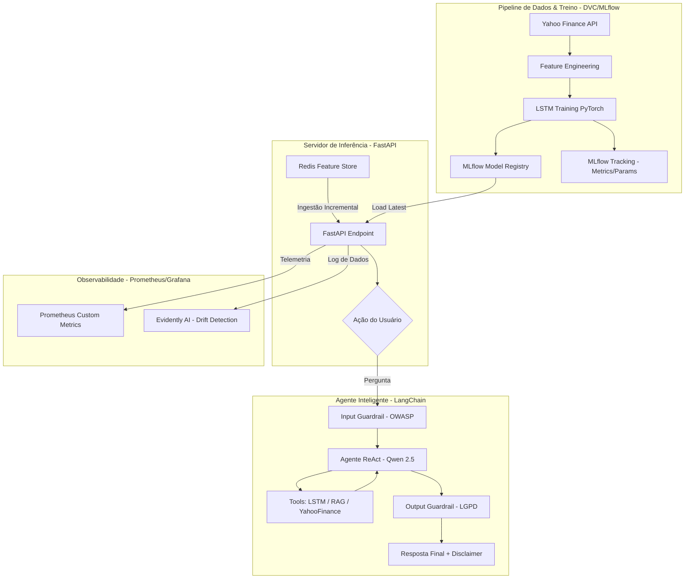

# 🏗️ Arquitetura do Sistema - Datathon Fase 05

Este documento detalha a arquitetura técnica do sistema de predição de ativos e agente financeiro, projetada sob os princípios de **MLOps** e **Defesa em Profundidade**.

---

## 1. Diagrama de Fluxo de Dados (Mermaid)

---

## 2. Descrição dos Componentes

### 2.1 Modelo Preditivo (LSTM)
*   **Arquitetura:** LSTM Multivariada com 6 features (`Close`, `Open`, `High`, `Low`, `Volume`, `EMA20`).
*   **Finalidade:** Capturar dependências temporais em janelas de 30 dias para prever o fechamento do próximo dia útil.
*   **Governança:** Versionado via DVC e trackeado via MLflow com Model Card detalhado em `docs/MODEL_CARD.md`.

### 2.2 Agente ReAct / Router
*   **Motor:** LLM `Qwen-2.5-0.5B-Instruct` executado localmente via HuggingFace Pipeline.
*   **Estratégia:** Utiliza um Agente Router otimizado para decidir entre:
    *   `obter_previsao_lstm`: Invocar o modelo de IA interno.
    *   `obter_cotacao_atual`: Buscar dados em tempo real via Yahoo Finance.
    *   `consultar_base_conhecimento`: Acessar o banco vetorial (RAG).
*   **Segurança:** Protegido por barreiras de entrada (Prompt Injection) e saída (PII masking).

### 2.3 Feature Store (Redis)
*   **Estratégia:** Implementa o padrão de atualização incremental para garantir baixa latência na inferência.
*   **Configuração:** Integrado ao FastAPI para fornecer os últimos 30 dias de dados instantaneamente.

---

## 3. Conformidade e Qualidade
*   **Avaliação:** Pipeline auditado via **RAGAS** (Fidelidade, Relevância, Precisão, Recall) e **LLM-as-Judge**.
*   **Segurança:** Mapeamento OWASP Top 10 para LLMs e APIs documentado em `docs/OWASP_MAPPING.md`.
*   **Monitoramento:** Dashboard Prometheus para métricas de latência e **Evidently AI** para detecção de Data e Target Drift.
