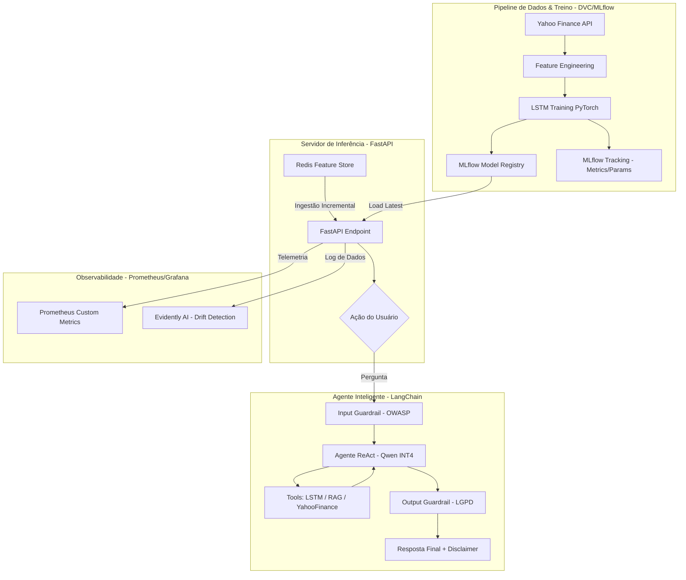

# 🏗️ Arquitetura do Sistema - Datathon Fase 05

Este documento detalha a arquitetura técnica do sistema de predição de ativos e agente financeiro, projetada sob os princípios de **MLOps** e **Defesa em Profundidade**.

---

## 1. Diagrama de Fluxo de Dados (Mermaid)

---

## 2. Descrição dos Componentes

### 2.1 Modelo Preditivo (LSTM)
*   **Arquitetura:** LSTM Multivariada com 6 features (OHLCV + EMA20).
*   **Finalidade:** Capturar dependências temporais em janelas de 30 dias para prever o fechamento do próximo dia útil.
*   **Governança:** Versionado via DVC e trackeado via MLflow com Model Card detalhado.

### 2.2 Agente ReAct
*   **Motor:** LLM Qwen-2.5-0.5B-Instruct quantizado em 4 bits para execução local.
*   **Estratégia:** Utiliza o framework ReAct para decidir entre consultar a base de conhecimento (RAG), buscar cotações em tempo real ou invocar o modelo de IA.
*   **Segurança:** Protegido por barreiras de entrada (Jailbreak) e saída (PII masking).

### 2.3 Feature Store (Redis)
*   **Estratégia:** Implementa o padrão de atualização incremental (GAP 03 do Datathon).
*   **Armazenamento:** Vetores serializados em JSON com TTL de 7 dias para garantir frescor dos dados sem perda de histórico durante flushes.

---

## 3. Conformidade e Qualidade
*   **Avaliação:** Pipeline auditado via RAGAS (4 métricas) e LLM-as-Judge (5 critérios de negócio).
*   **Segurança:** Mapeamento OWASP Top 10 e Relatórios de Red Teaming documentados.
*   **Monitoramento:** Dashboard Prometheus para latência/erros e Evidently para detecção de degradamento de performance (*Drift*).
